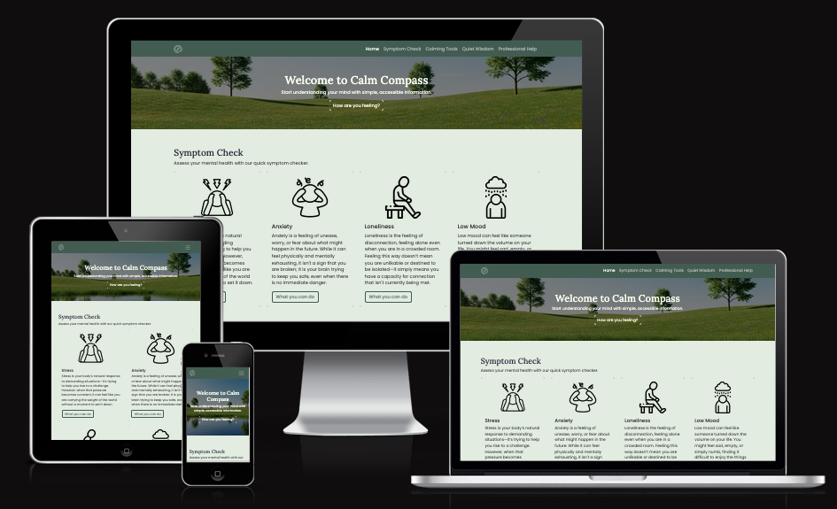
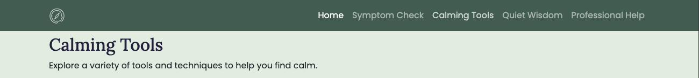
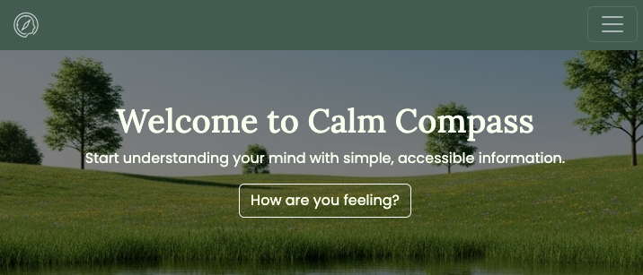
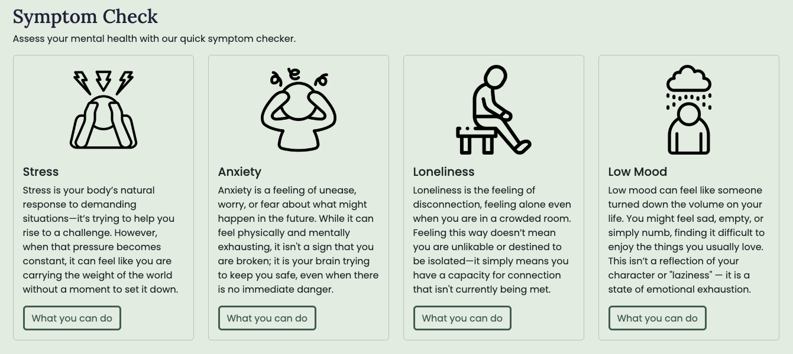
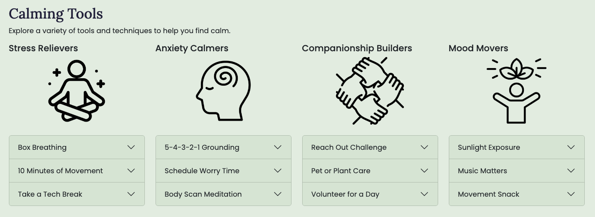
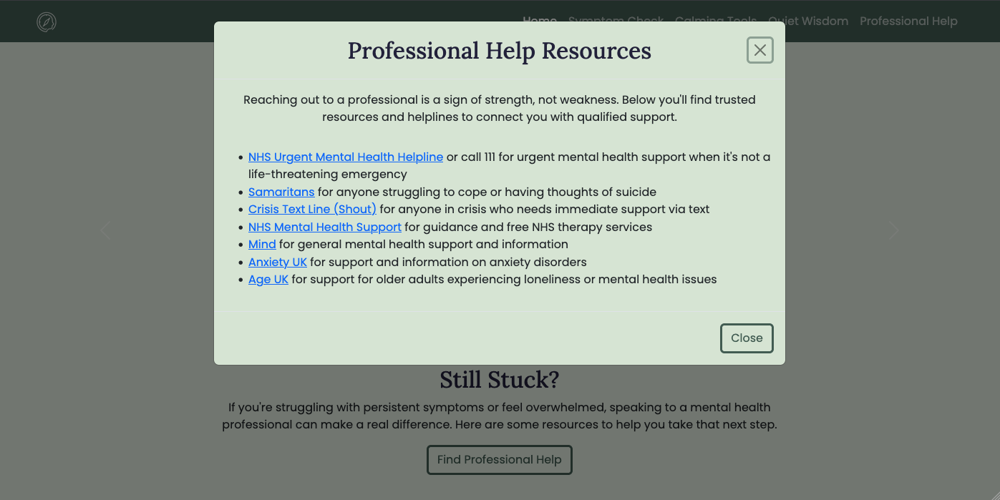
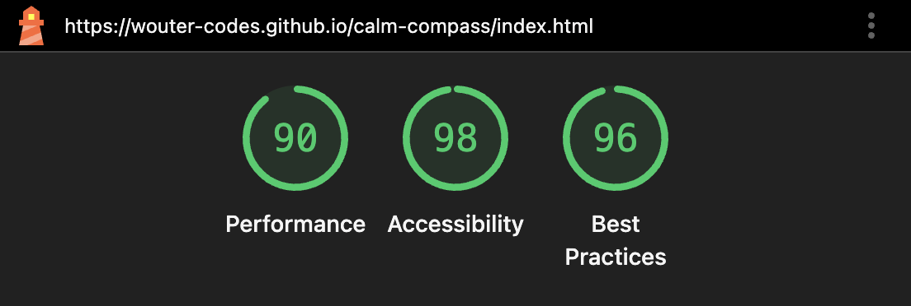

# Calm Compass

## Mental Health Awareness & Self-Help Resource

_Calm Compass displayed across multiple devices — desktop, tablet, and mobile_

**Live Site:** https://wouter-codes.github.io/calm-compass/

---

## Purpose

Calm Compass is a single-page web application designed to provide accessible, beginner-friendly mental health information and self-help tools in a simple calming environment. The site aims to:

-   **Help users identify symptoms** of common mental health challenges (stress, anxiety, loneliness, low mood)
-   **Provide practical coping techniques** that users can try immediately
-   **Connect users with professional resources** when self-help isn't enough

The project creates a safe digital space where users can explore their feelings and discover evidence-based tools to support their wellbeing.

---

## UX Design

### Strategy

-   **External User’s Goal:** accessible, beginner-friendly information on mental health, including how to recognize common issues and manage stress, presented in a supportive and organised layout.

-   **Site Owner’s Goal:** to create a welcoming webpage that provides basic mental health information using a clean and supportive design. The focus is on using HTML and CSS with Bootstrap to create a calming and well-organised user experience.

### Scope

The following user stories were created to drive the design of the features:

-   As a site user on whatever size device, I want to navigate easily through the website so that I can find the information I need.

-   As a distressed user seeking mental health guidance, I want to see a calm, reassuring, welcoming main message and clear call to action, so I feel safe, know instantly what the site is about, and know where to start.

-   As a user experiencing mental health struggles, I want to easily and quickly find an overview of common psychological, emotional, and behavioral symptoms/signs, so I can quickly recognise and validate if what I'm feeling is normal.

-   As a user looking for quick relief, I want to find actionable, step-by-step self-help exercises so that I can try to calm myself down right away.

-   As a user who is hesitant to take the next step, I want to read short, gentle quotes so that I feel inspired and confident to seek help.

-   As a user who needs professional help, I want a clean list of actionable links so that I can easily click through to find organisations which can help me

### Structure

A simple, linear structure of the website helps to not overload users with information. A clean step-by-step to walk the user through the following stage:

1. Reassure user
2. Identify feelings
3. Self-help tools
4. Inspire user to take action
5. Resources for users needing professional help

### Skeleton

Bootstrap was used to create a responsive and clean design. The following wireframe was made:

### Surface

#### Colours

The pastel colour palette was chosen to evoke feelings of **calm, nature, and safety** — avoiding harsh colours that might increase anxiety.

| Colour            | Hex Code  | Usage                   |
| ----------------- | --------- | ----------------------- |
| Deep Sage         | `#425c52` | Navbar, footer, buttons |
| Beige Green       | `#e2ecdf` | Primary background      |
| Light Beige Green | `#d6e4d2` | Accordion backgrounds   |
| Dark Blue         | `#22223b` | Headings                |
| Off White         | `#f8ffed` | Light text, hero text   |

#### Typography

-   **Lora** (serif) — Warm, approachable and trusting font for **headings**
-   **Poppins** (sans-serif) — Popular, clean, modern font for **body text**

---

## Features

The features below were derived from the user experience and design findings above.

### Navigation Bar

_Navigation bar on larger screens (from 992px)_

 
_Mobile navbar with hamburger menu on smaller screens (up to 992px)_

-   **Fixed position** — always accessible as users scroll
-   **Responsive collapse** — transforms to hamburger menu on mobile devices
-   **Smooth scrolling** — navigates to page sections with animated scroll
-   **User Value:** Users can quickly jump to any section without losing their place

---

### Hero Section

_Welcoming hero section with calming landscape imagery_

-   **Calming visual design** — landscape image with soft overlay
-   **Clear call-to-action** — "How are you feeling?" button invites exploration
-   **User Value:** Creates an immediate sense of safety and welcome, reducing anxiety about engaging with mental health content

---

### Symptom Check

_Four symptom cards helping users identify their feelings_

-   **Four key areas:** Stress, Anxiety, Loneliness, and Low Mood
-   **Empathetic descriptions** — validates feelings without medical jargon
-   **Direct links** — "What you can do" buttons navigate to relevant coping tools
-   **Responsive grid** — adapts from 4 columns (desktop) to single column (mobile)
-   **User Value:** Helps users name and understand their emotions, which is often the first step toward feeling better

---

### Calming Tools

_Accordion-style expandable sections with practical techniques_

-   **Organised by symptom** — Stress Relievers, Anxiety Calmers, Companionship Builders, Mood Movers
-   **Accordion interface** — keeps information tidy and non-overwhelming
-   **How & Why format** — each technique explains both the action and the science behind it
-   **User Value:** Provides immediate, evidence-based coping strategies users can try right away

---

### Quiet Wisdom

_Inspirational quotes carousel with author images_

-   **Auto-rotating carousel** — cycles through quotes automatically
-   **Manual controls** — previous/next buttons for user control
-   **Circular author images** — personal touch with recognisable figures
-   **User Value:** Offers comfort and perspective from trusted voices, helping users feel less alone

---

### Professional Help

_Modal window with UK mental health resources_

-   **Modal overlay** — keeps users on the page while accessing resources
-   **Trusted UK resources** — NHS, Samaritans, Mind, Anxiety UK, and more
-   **External links** — open in new tabs with appropriate security attributes
-   **User Value:** Provides a clear pathway to professional support when self-help isn't sufficient

---

### Footer

_Simple footer with copyright and social media links_

-   **Social media links** — Instagram, Facebook, X (Twitter), LinkedIn
-   **Accessible icons** — ARIA labels describe each link's destination
-   **User Value:** Allows users to connect with the organisation through their preferred platform

---

## Accessibility

-   ✅ Semantic HTML5 elements (`<header>`, `<main>`, `<section>`, `<nav>`, `<footer>`)
-   ✅ Descriptive `alt` text on all images
-   ✅ ARIA labels on interactive elements and external links
-   ✅ `rel="noopener"` on external links for security
-   ✅ Sufficient colour contrast for readability
-   ✅ Responsive design for all screen sizes
-   ✅ 98% on Lighthouse Accessibility report

---

## Testing

### Device Testing

Responsive design was tested on the following devices:

| Device        | Screen Size | Result |
| ------------- | ----------- | ------ |
| iPhone SE     | 375px       | Pass   |
| iPhone 12 Pro | 390px       | Pass   |
| iPad          | 768px       | Pass   |
| iPad Pro      | 1024px      | Pass   |
| Desktop       | 1920px      | Pass   |

### Validator Testing

**HTML** — No errors were returned when passing through the official W3C validator

**CSS** — No errors were found when passing through the official (Jigsaw) validator

**Lighthouse report** — No major errors found, 90% or higher scores across the board

---

## Deployment Procedure

This project is deployed using **GitHub Pages**. The steps to deploy are as follows:

-   In the GitHub repository, navigate to the Settings tab
-   From the source section drop-down menu, select the Master Branch
-   Once the master branch has been selected, the page will be automatically refreshed with a detailed ribbon display to indicate the successful deployment.

The live site can be found at: https://wouter-codes.github.io/calm-compass/

---

## Credits

### Content

-   Mental health information and coping techniques informed by general mental health best practices
-   UK mental health resources include NHS, Samaritans, Mind, Anxiety UK, Crisis Text Line, and Age UK

### Images

-   **Hero image:** sourced from [Easy-Peasy AI](https://easy-peasy.ai/ai-image-generator/images/tranquil-landscape-peace-harmony)
-   **Section icons:** All icons were sourced from [Flaticon](https://www.flaticon.com/free-icons/database)
-   **Rounded profile pictures for quotes section:**
    -   [Banksy](https://www.myartbroker.com/artist-banksy/articles/banksy-girl-with-balloon-14-million-icon-in-print-market)
    -   [Haruki Murakami](https://m.media-amazon.com/images/I/71OcMaF8NcL._AC_UF894,1000_QL80_.jpg)
    -   [Maya Angelou](https://www.zinnedproject.org/wp-content/uploads/2014/05/MayaAngelou-1200x1490.jpg)
    -   [Leonard Cohen](https://macm.org/app/uploads/2017/06/LC-on-train-e1508440881983.jpg)
    -   [Virginia Woolf](https://upload.wikimedia.org/wikipedia/commons/0/0b/George_Charles_Beresford_-_Virginia_Woolf_in_1902_-_Restoration.jpg)
-   **Logos:** Generated by [Gemini Nano Banana Pro](https://gemini.google/overview/image-generation/) and converting them into icons using [Favicon.io](https://favicon.io/)

### Code

-   **Bootstrap 5 Documentation:** Navbar, accordion, modal, and carousel components adapted from [Bootstrap 5 Docs](https://getbootstrap.com/docs/5.3/)
-   **Font Awesome:** Icons sourced from [Font Awesome](https://fontawesome.com/)
-   **Google Fonts:** Typography from [Google Fonts](https://fonts.google.com/)

---

## Technologies Used

| Technology          | Purpose                                             |
| ------------------- | --------------------------------------------------- |
| **HTML5**           | Semantic structure and content                      |
| **CSS**             | Custom styling, CSS variables, media queries        |
| **Bootstrap 5.3.8** | Responsive grid, navbar, accordion, modal, carousel |
| **Font Awesome**    | Social media icons                                  |
| **Google Fonts**    | Poppins and Lora typefaces                          |
| **Git**             | Version control                                     |
| **GitHub**          | Repository hosting                                  |
| **GitHub Pages**    | Deployment and hosting                              |

---

## AI Assistance

This project was developed with assistance from **GitHub Copilot** (Claude) and **Gemini** (including _Nano Banana_) for:

-   Debugging CSS issues (flexbox card alignment, scroll-margin-top for fixed navbar)
-   Image generation (creation of logo)
-   Generating ideas for website content and wording (titles, cards, accordion and quotes content)
-   Code review and accessibility suggestions
-   README structure and content suggestions.

All AI-generated code was reviewed, tested, and adapted to fit the project requirements.
